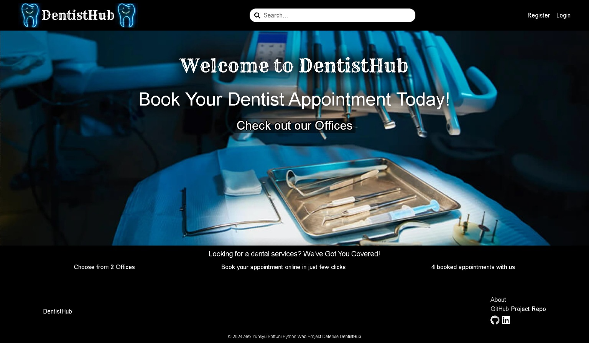
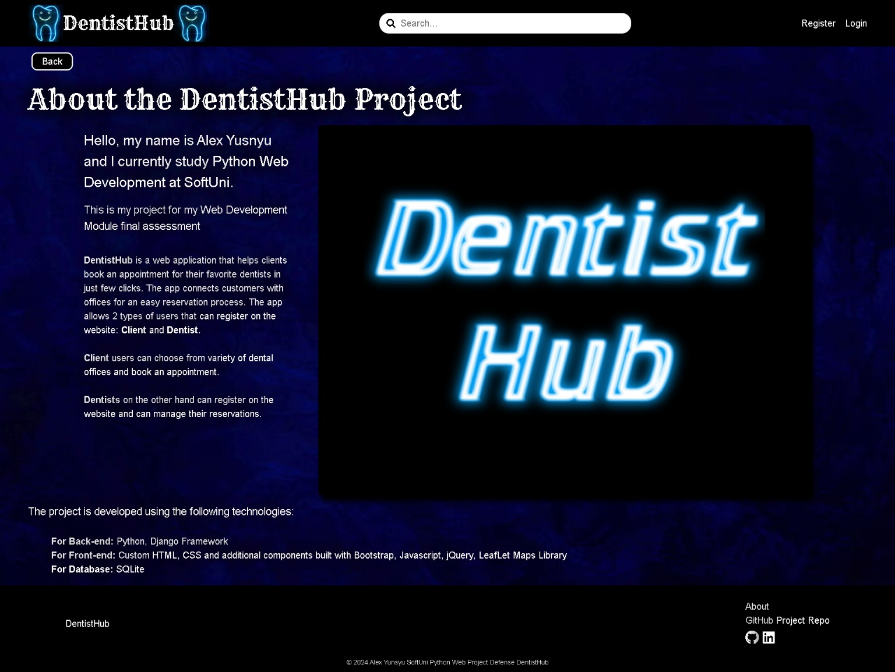
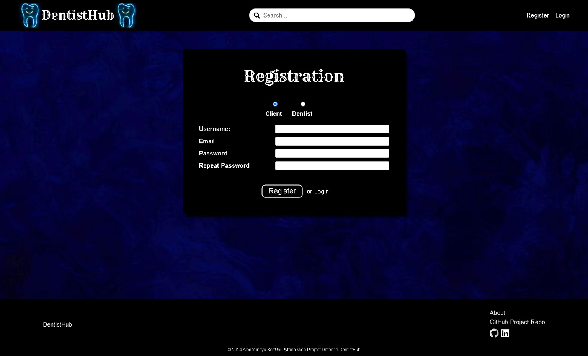
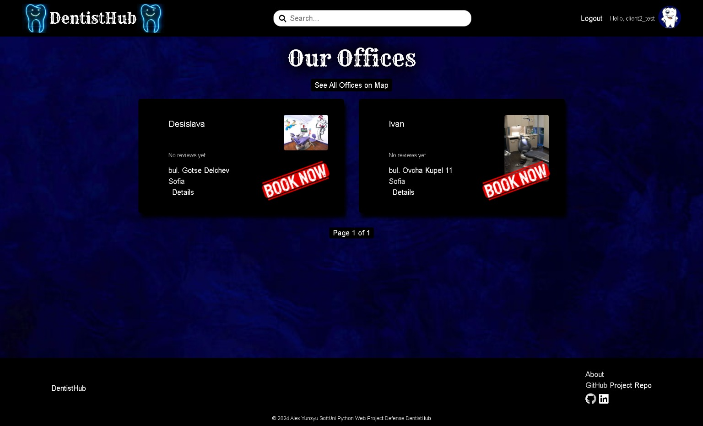
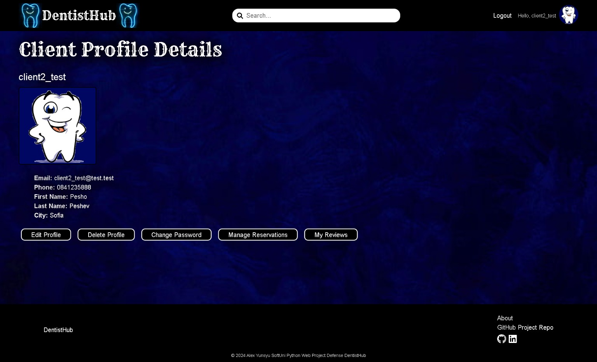
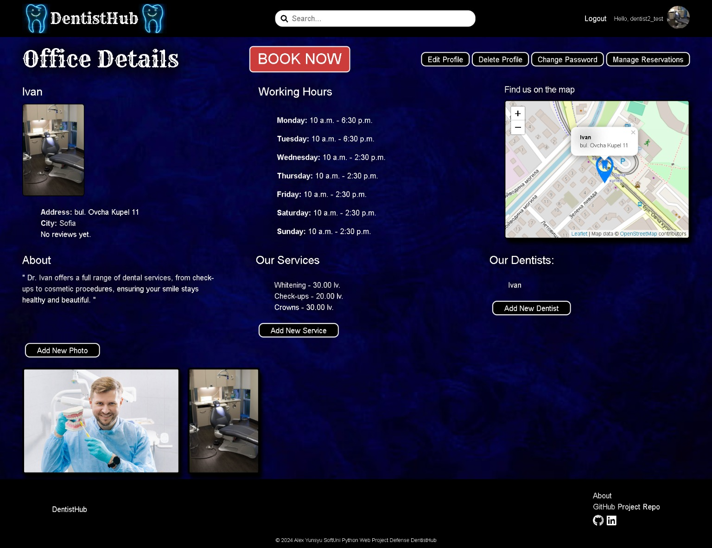
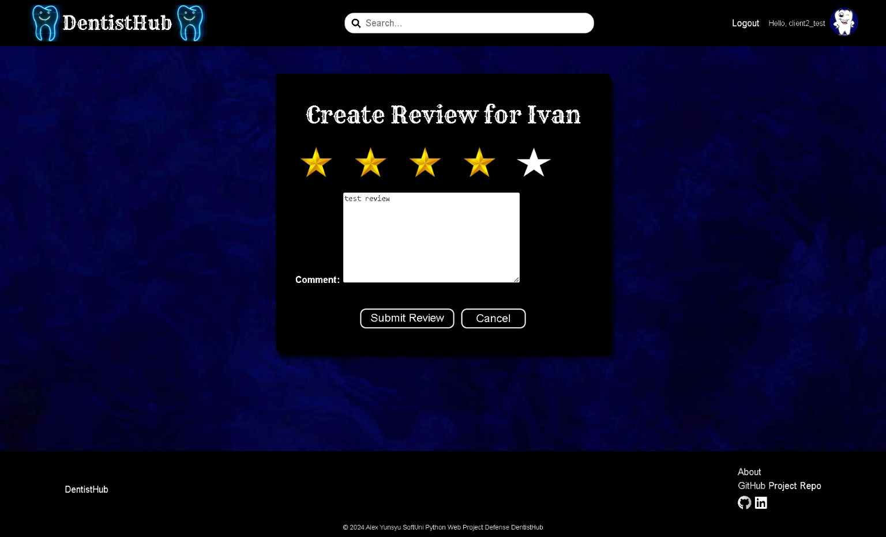
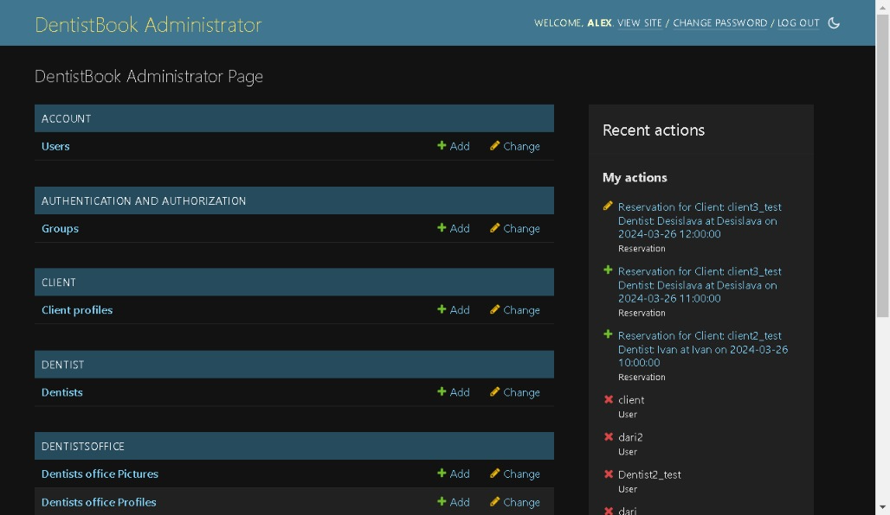

# **DentistHub**

**DentistHub** is a web application developed with Django. It serves as a platform for clients to book appointments with dentists conveniently, while also allowing dentists to manage their appointments effectively.

## Short Functionality Description:

The app caters to two main user types: **Client** and **Dentist**.

- **Client Profile:** Clients can register, log in, log out, delete their profile, change passwords, edit personal details, add profile pictures, manage reservations, and leave reviews for visited dentists.
- **Dentist Profile:** Dentists can register, log in, log out, delete their profile, change passwords, edit details, manage services, working hours, add profile pictures, and manage reservations.
- Dentist offices can be searched using a search field, a list view, or via a map interface.
- The reservation process involves six steps where clients select the dentist office, dentist, service, date, and time based on availability before confirming the reservation.
- The application features a responsive design optimized for mobile devices.

## Technologies Used:

### Backend:
- Python
- Django Framework

### Frontend:
- HTML
- CSS with Bootstrap
- JavaScript and jQuery
- LeafLet Maps Library

### Database:
- SQLite

## Screenshots:

### Screenshot 0

### Screenshot 1

### Screenshot 2

### Screenshot 3

### Screenshot 4

### Screenshot 5

### Screenshot 6

### Screenshot 7

### Screenshot 8

